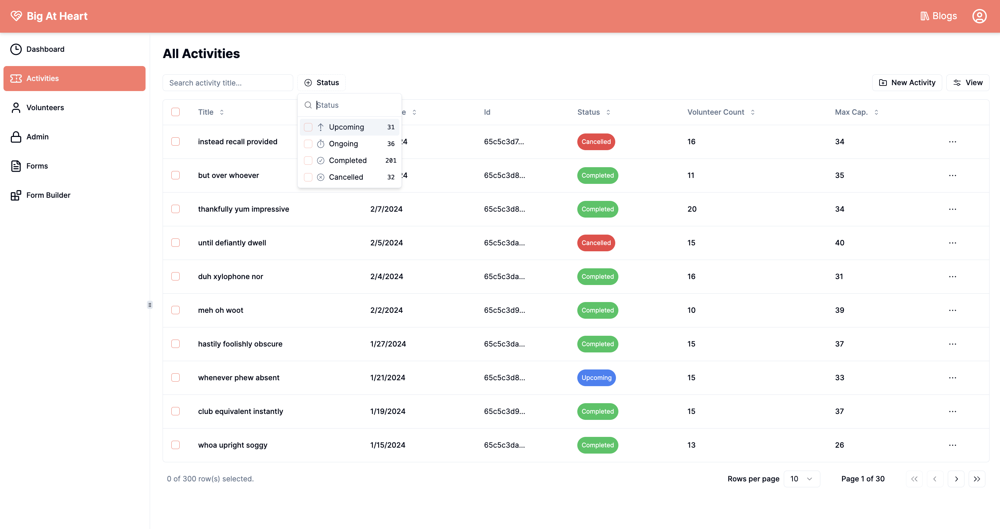

<!-- Improved compatibility of back to top link: See: https://github.com/othneildrew/Best-README-Template/pull/73 -->

<!--
*** Thanks for checking out the Best-README-Template. If you have a suggestion
*** that would make this better, please fork the repo and create a pull request
*** or simply open an issue with the tag "enhancement".
*** Don't forget to give the project a star!
*** Thanks again! Now go create something AMAZING! :D
-->

<!-- PROJECT SHIELDS -->
<!--
*** I'm using markdown "reference style" links for readability.
*** Reference links are enclosed in brackets [ ] instead of parentheses ( ).
*** See the bottom of this document for the declaration of the reference variables
*** for contributors-url, forks-url, etc. This is an optional, concise syntax you may use.
*** https://www.markdownguide.org/basic-syntax/#reference-style-links
-->
<!-- PROJECT LOGO -->
 
  <h3 align="center">Codingbears</h3>

  

    A comprehensive platform for volunteer journey management.
     
     
     
  

<!-- TABLE OF CONTENTS -->

  
Table of Contents

  <ol>
    <li>
      <a href="#about-the-project">About The Project</a>
      <ul>
        <li><a href="#built-with">Built With</a></li>
      </ul>
    </li>
    <li>
      <a href="#getting-started">Getting Started</a>
    </li>
    <li><a href="#features">Features</a></li>
    <li><a href="#acknowledgments">Acknowledgments</a></li>
  </ol>

<!-- ABOUT THE PROJECT -->

## About The Project

### Built With

- [![Next][Next.js]][Next-url]
- [![React][React.js]][React-url]
- [![MongoDB][Mongodb.com]][MongoDB-url]
- [![Amazon AWS][aws.amazon.com]][Amazon-AWS-url]
- [![Python][Python]][Python-url]
- [![TailwindCSS][TailwindCSS]][TailwindCSS-url]

(<a href="#readme-top">back to top</a>)

We've built a robust platform that includes a seamless user interface, synced to a comprehensive backend database. This application is designed to streamline the management of volunteering events and offers a suite of tools for both administrators and volunteers, simplifying the process of signing up for, creating, and managing volunteering events. Below you'll find a guide on how to utilize our features effectively.

<!-- GETTING STARTED -->

## Getting Started

You can access our live web app directly <a href="https://hack4good-alpha.vercel.app/">here</a>. No installation needed whatsoever.

(<a href="#readme-top">back to top</a>)

<!-- USAGE EXAMPLES -->

## Features for Admin Side

You will require an admin account to access some of the following features. Here is the credentials to log in to a pre-created admin account.

**Email:** `admin@m.com`  
**Password:** ``

### Dashboard

- **Monthly Navigation**: Interactively click through months to view the analytics of all events that took place in that month.
- **Data Overview**: Get a quick and comprehensive overview of some of the statistics such as total volunteer attendance, total hours, including comparisons from the previous month.
- **Data Visualization**: Hover over pie charts to reveal detailed statistics on volunteer participation by region and gender.
- **Monthly Reports**: Easily download comprehensive monthly reports with a single click, providing insights into volunteer activities and engagements.

### Form Builder

- **Create New Forms**: Design custom forms tailored to your event's needs, from volunteer sign-up sheets to feedback forms.
- **Customizable Questions**: Add, remove, and reorder questions to ensure your form collects all the necessary information.
- **Form Management**: Save new forms for future use and select from existing forms to edit or repurpose them.

### Forms

- **Efficient Search**: Quickly locate forms using the search feature, including the newly created forms.
- **Edit Forms**: Revisit and modify forms as needed, ensuring they remain up-to-date and relevant.
- **Form Preservation**: Save changes to forms, maintaining a current and accessible form library.

### Activities

- **Advanced Filtering**: Utilize filters to sort activities by date, volunteer count, and status, making it easier to find specific events.
- **View Functionality**: Adjust view settings to tailor the display of activities to your preferences.
- **Activity Management**: Edit activity details, link activities to specific forms, and conduct searches for activities using keywords.

 

### Volunteers

- **Sorting and Filtering**: Sort volunteers using various criteria and filter by status and gender for targeted management.
- **Comprehensive Search**: Find volunteers by name, streamlining the process of accessing volunteer profiles.
- **Volunteer Profiles**: View detailed volunteer information, including participation history and personal details.

  

## Features for Volunteer Side

## Explore Page

- **Featured Section**: Allows volunteers to view and register for featured activities that are in demand.
- **For You Section**: Allows volunteers to view and register for activities that are tailored to them, based on their interests that they provided when registering as a verified volunteer.
- **Featured Section**: Allows volunteers to view their upcoming events that they have registered for.

## Individual Activity Listing

- **Details**: Details of the event are displayed for volunteers to take note of, and be informed.
- **Register buttonn**: Allows volunteers to view and register for featured activities that are in demand.
- **Withdraw button**: Allows volunteers to withdraw for the registered activity.
- **Contact us button**: Allows volunteers to email and stay in touch with the organiser.

    
    
    

## Profile Page

- **Past Events**: Volunteer's past activities are displayed, and they are able to provide their feedback and thoughts on each event.
- **Certificate**: Volunteer's certificate collection is displayed, and they are able to download and retrieve each certificate by simply clicking on them.
- **About Me**: Allows volunteers to update their information.

## Blogs

- **Past Events**: Allows volunteers to view their own, and other volunteers feedback and reflections to stay connected.

(<a href="#readme-top">back to top</a>)

<!-- ACKNOWLEDGMENTS -->

## Acknowledgments

- [Shadcn](https://ui.shadcn.com/)
- [HuggingFace](https://huggingface.co/)
- [NextJS](https://nextjs.org/)
- [Img Shields](https://shields.io)
- [Lucide](https://lucide.dev/)
- [React Icons](https://react-icons.github.io/react-icons/search)

(<a href="#readme-top">back to top</a>)

<!-- MARKDOWN LINKS & IMAGES -->
<!-- https://www.markdownguide.org/basic-syntax/#reference-style-links -->

[Next.js]: https://img.shields.io/badge/next.js-000000?style=for-the-badge&logo=nextdotjs&logoColor=white
[Next-url]: https://nextjs.org/
[Mongodb.com]: https://img.shields.io/badge/MongoDB-4EA94B?style=for-the-badge&logo=mongodb&logoColor=white
[Aws.amazon.com]: https://img.shields.io/badge/Amazon_AWS-232F3E?style=for-the-badge&logo=amazon-aws&logoColor=white
[Amazon-AWS-url]: https://aws.amazon.com/
[MongoDB-url]: https://www.mongodb.com/
[React.js]: https://img.shields.io/badge/React-20232A?style=for-the-badge&logo=react&logoColor=61DAFB
[React-url]: https://reactjs.org/
[Python]: https://img.shields.io/badge/Python-3776AB?style=for-the-badge&logo=python&logoColor=white
[Python-url]: https://www.python.org/
[TailwindCSS]: https://img.shields.io/badge/Tailwind_CSS-38B2AC?style=for-the-badge&logo=tailwind-css&logoColor=white
[TailwindCSS-url]: https://tailwindcss.com/
